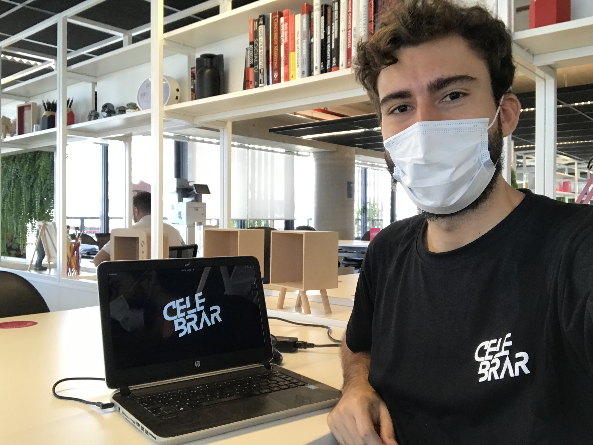

Celebrar means "to celebrate" in portuguese, and is a startup that connects big corporations with event service providers of all kinds, especially small businesses and individuals that offer high-quality services but hardly have access to opportunities at most corporate events. That happens mostly because of the contrast between the bureaucracy inside big companies and the high level of informality of the market in which these people are used to operate, and Celebrar aims to use technology to establish a connection between these two.

I got hired in January 2022 as a junior full-stack developer, my first work experience in software development, and I've been learning a lot since them. In short, my job as part of the tech team is to maintain, fix bugs and implement new features in two web applications. The first one is the app that is used by event service providers to receive job opportunities, send their offers, manage their sales and submit invoices. This app is composed of a Node.js back-end and a React front-end, and a MySQL database. The other app is the one that is used by the operations team to manage sales, orders, send job opportunities, and this one is built with PHP and the Laravel framework (techs that I had never worked with before, and that I'm trying to catch up quickly).

A great thing about working in a small company is that I can be in contact with every aspect of the development and operation process as a whole, and that is giving me a broader and more complete view about how the web environment works, something that I didn't have when I was studying front-end and back-end development separately and in a focused way. I've also learned a lot about real-world problems that come to surface when hundreds of people are using your application, and you need to solve them fast because that number is quickly increasing (something that made me a lot more interested in topics like DevOps and Site Reliability Engineering). I'm also learning a lot about other areas like design, user experience and product management.

Another interesting point is that as the company grows and our product evolves, our tech team is evolving too, so we are constantly trying to improve our workflow to match the fast-paced startup environment that we're in, with ever-changing requirements and priorities, and the pressure to deliver new features quickly.

