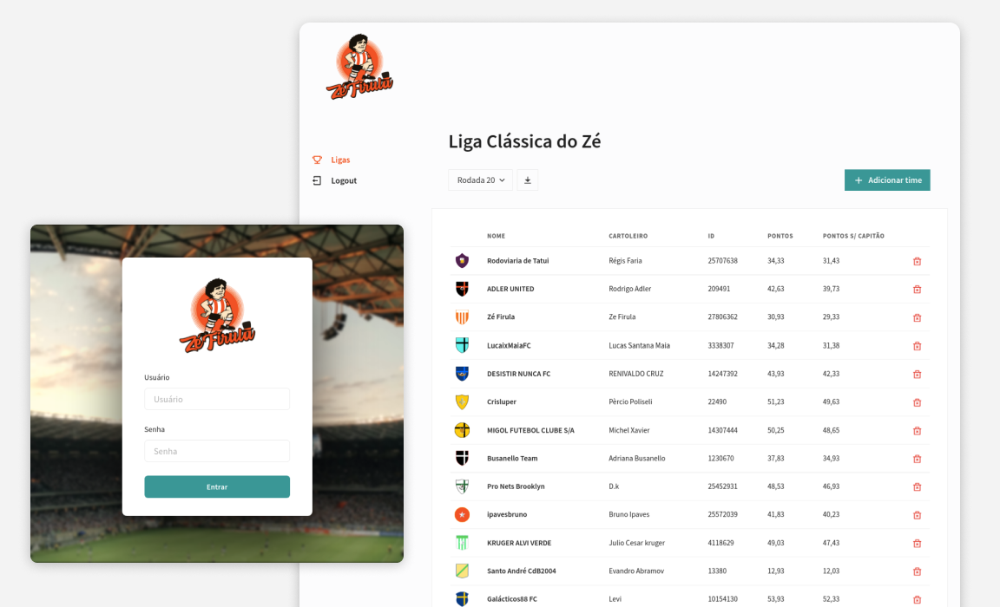

Zé Firula is a project I built to help a couple of friends with their hobby. These friends create and manage custom leagues for the CartolaFC game (a popular fantasy football game in Brazil), but they had a lot of hard work twice a week entering the official website and grabbing the updated scores manually for each team.

The app allows users to create custom leagues and add teams to them, and automatically gets the updated scores for each round on the CartolaFC API. It's also possible to export a CSV file containing all the scores for a desired league.

### Front-end

The front-end is a React application, written in TypeScript and built with Next.js. The Chakra UI component library was used for styling, and React Query was used to fetch and sync data from the API. The app was deployed on Vercel.

**Techs:**: TypeScript, Next.js, Chakra UI, React Query, Vercel

**Repository:** https://github.com/msgaspar/zefirula-web

### Back-end

The back-end is a Node.js REST API built with Express and written in TypeScript. Data is stored on a PostgreSQL database, managed using TypeORM. User authentication is provided using JWT token.

The app is built using a layered architecture and coupling between layers is decreased by applying dependency injection with TSyringe.

Docker was used to package the app into a container during development, and the app was deployed to an instance on Amazon EC2. An automatic deployment workflow was created on GitHub to optimize the deployment process.

**Techs:** TypeScript, Node.js, Express, TypeORM, PostgreSQL, Docker, AWS, Github Actions

**Repository:** https://github.com/msgaspar/zefirula-api
